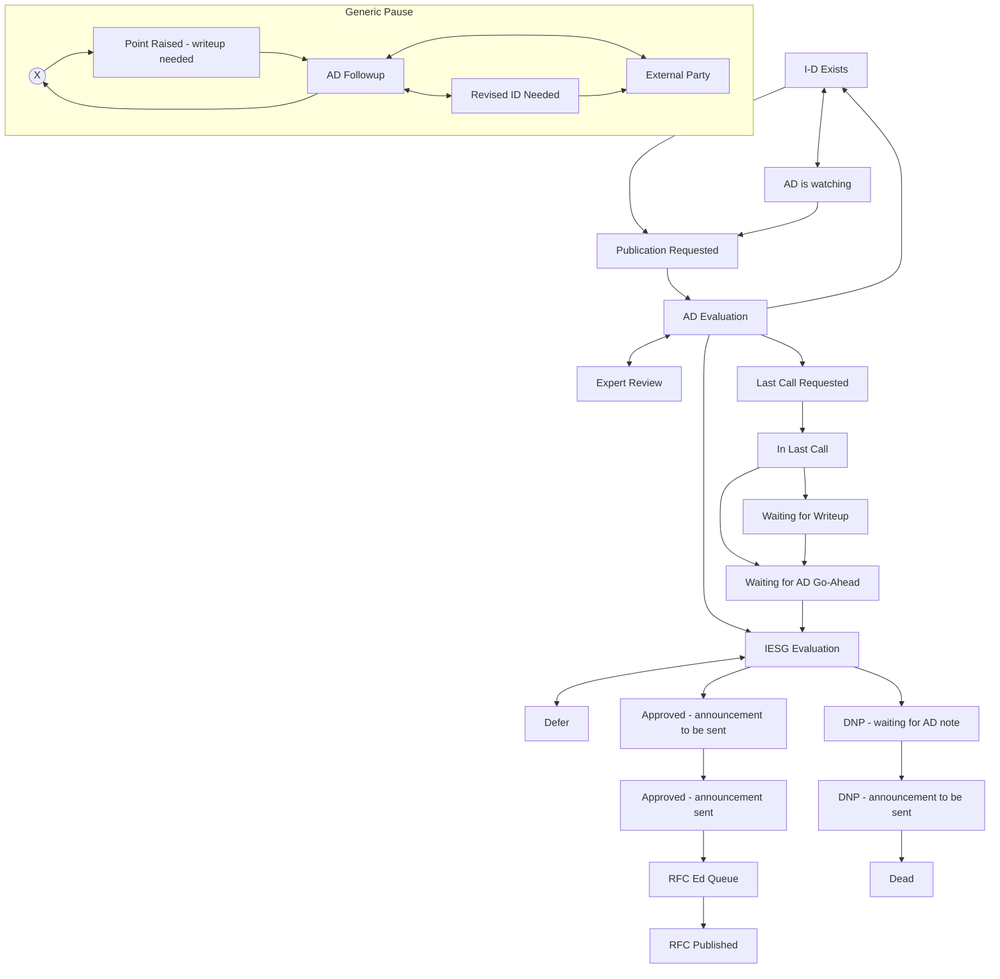

```mermaid
graph TD
    %% Main Flow Nodes
    ID_Exists[I-D Exists]
    AD_Watching[AD is watching]
    Pub_Req[Publication Requested]
    AD_Eval[AD Evaluation]
    Expert_Review[Expert Review]
    LC_Req[Last Call Requested]
    In_LC[In Last Call]
    Waiting_Writeup[Waiting for Writeup]
    Waiting_GoAhead[Waiting for AD Go-Ahead]
    IESG_Eval[IESG Evaluation]
    Defer[Defer]
    
    %% Approval Path
    Appr_ToBeSent[Approved - announcement to be sent]
    Appr_Sent[Approved - announcement sent]
    RFC_Queue[RFC Ed Queue]
    RFC_Pub[RFC Published]

    %% DNP Path
    DNP_Note[DNP - waiting for AD note]
    DNP_ToBeSent[DNP - announcement to be sent]
    Dead[Dead]

    %% Main Flow Connections
    ID_Exists <--> AD_Watching
    ID_Exists --> Pub_Req
    AD_Watching --> Pub_Req
    Pub_Req --> AD_Eval
    AD_Eval --> ID_Exists
    AD_Eval <--> Expert_Review
    AD_Eval --> LC_Req
    AD_Eval --> IESG_Eval
    
    LC_Req --> In_LC
    In_LC --> Waiting_Writeup
    In_LC --> Waiting_GoAhead
    Waiting_Writeup --> Waiting_GoAhead
    Waiting_GoAhead --> IESG_Eval
    
    IESG_Eval <--> Defer
    
    %% Branching from IESG Evaluation
    IESG_Eval --> Appr_ToBeSent
    IESG_Eval --> DNP_Note
    
    %% Path to Publication
    Appr_ToBeSent --> Appr_Sent
    Appr_Sent --> RFC_Queue
    RFC_Queue --> RFC_Pub
    
    %% Path to Dead
    DNP_Note --> DNP_ToBeSent
    DNP_ToBeSent --> Dead

    %% Generic Pause Subgraph
    subgraph Generic_Pause [Generic Pause]
        X((X))
        Point_Raised[Point Raised - writeup needed]
        AD_Followup[AD Followup]
        Revised_ID[Revised ID Needed]
        External_Party[External Party]

        X --> Point_Raised
        Point_Raised --> AD_Followup
        AD_Followup --> X
        AD_Followup <--> Revised_ID
        AD_Followup <--> External_Party
        Revised_ID --> External_Party
    end
```
